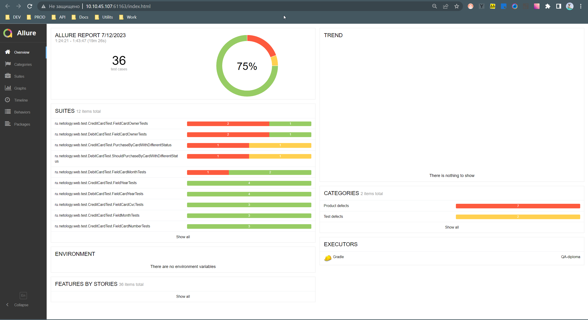

# Отчет по итогам тестирования

### 1.Краткое описание:
В рамках данного проекта стояла задача - автоматизировать тестирование комплексного сервиса покупки тура, взаимодействующего с СУБД и API Банка.

### 2.Общее количество автоматизированных тест-кейсов 36 из них:
- успешных 28
- неуспешных 8 
- соотношение в процентах 75% / 25% 

По результатам авто-тестов составлены баг-репорты, описанные в issues ( https://github.com/alexkv2602/QA-diploma/issues)

### 3.Общие рекомендации:

Сервис не готов к релизу, так как найденные баги критичны и негативно скажутся на бизнесе, необходима доработка сервиса и устранение багов.
